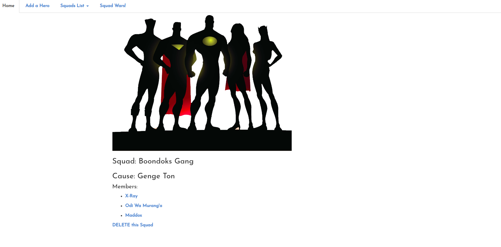

# Hero Squad

#### The web application allows a user to create a squad, name it, provide its purpose and max size then assign superheroes to the squad. The superheroes to be added to the squad are also created.

#### By Shadrack Adwera

## Description

A hero object is used to store hero properties such as name, age etc the hero is in turn assigned to a squad through the squad id property. A postgres database has been used to store the objects once created through the form inputs.

## Setup/Installation Requirements

* You need to install the [Java SDK](https://sdkman.io/install) in order to create Java applications and the [Java Runtime Environment](https://sdkman.io/usage) which provides the requirements for executing a Java application.
* The code can be run on any java IDE: NetBeans, IntelliJ IDEA, Eclipse etc
* On ItelliJ, simply run the command **$ gradle run** and navigate to **localhost:4567** to view the website

## Behaviour driven design

Hero Squad

1. Displays add a squad form when add a squad link is clicked
    * INPUT: "Add a squad link is clicked"
    * OUTPUT: "Displays add a squad form"
2. Displays add a hero form when add a hero link is clicked
    * INPUT: "Add a hero link is clicked"
    * OUTPUT: "Displays add a hero form"
3. Displays hero details upon clicking of a hero name
    * INPUT: "Hero name is clicked"
    * OUTPUT: "Displays hero details"
4. Displays squad details when squad name, nested in the squad list nav item, on the nav bar is clicked
    * INPUT: "Squad name is clicked"
    * OUTPUT: "Displays squad details"
5. Displays field required when any of the form inputs is ommitted on either forms
    * INPUT: ""
    * OUTPUT: "Field name required"
6. Redirects to the home page upon delete a hero button is clicked
    * INPUT: "Clicked delete hero button"
    * OUTPUT: "Home page"
7. Redirects to home page upon clicked delete squad link
    * INPUT: "Clicked delete squad link"
    * OUTPUT: "Home page"

## Overview

* Upon loading the website, the homepage is displayed

* A user is requested to create a squad first when they click on the add a hero link

* On clicking the create a squad link, the page below loads

* After adding a squad, a hero can now be created and assigned to the created squad

* Hero details can be viewed on clicking the hero name on the home page

* The squad and its heroes can be viewed on clicking the squad name which is nested on the navbar item: squad list

* Check out the live link: <http://adwera-hero-squad.herokuapp.com/>

## Routing

| Route Name  | URL                                   | HTTP Verb     | Description                 |
|---          |---                                    |---            |---                          |
| index       | /                                     | GET           | Displays the landing page   |
| squads      | /squads/new                           | GET           | Displays add a squad form   |
| squads      | /squads                               | POST          | Process add a squad form    |
| squad-detail| /squads/:id                           | GET           | View squads and heroes      |
| heroes      | /heroes/new                           | GET           | Displays add a hero form    |
| heroes      | /heroes                               | POST          | Process add a hero form     |
| hero-detail | /squads/:squadId/heroes/:heroId       | GET           | Show an individual hero     |
| index       | /squads/delete                        | GET           | Delete all squads and heroes|
| index       | /heroes/delete                        | GET           | Delete all heroes           |
| index       | /squads/:squadId/heroes/:heroId/delete| GET           | Delete a hero               |
|  index      | /squads/:id/delete                    | GET           | Delete a squad              |
| wars        | /wars                                 | GET           | Show the coming soon page   |

## Known Bugs

* Incase any bug is found, or a request for a new fuctionality is needed, kindly open an issue [here](https://github.com/ShadrackAdwera/HeroSquad/issues)

## Technologies Used

* IntelliJ IDEA
* PostgreSQL

## Support and contact details

Feel free to contribute to the project by:

* Forking the repo
* Create a new branch (git branch my-contribution)
* Move to your branch (git checkout my-contribution)
* Make the changes in the files
* Add changes to reflect the changes made
* Commit your changes (git commit -m "Added features")
* Push to the branch (git push origin my-contriution)
* Create a Pull Request

Incase of any feedback/comments feel free to contact me at adweshshaddie@gmail.com

### License

#### Copyright (c) 2019 Shadrack Adwera

#### Licenced under the [MIT License](LICENSE)
